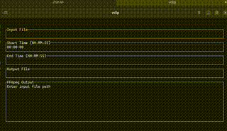

# vclip

A terminal-based video clip extraction tool using FFmpeg.


## Features

- Interactive TUI (Terminal User Interface)
- Real-time FFmpeg output display with auto-scrolling
- Simple input fields for:
  - Input video file path
  - Start time (HH:MM:SS)
  - End time (HH:MM:SS)
  - Output file path

## Controls

- `Tab`: Cycle through input fields
- `Enter`: Start processing when all fields are filled
- `Backspace`: Delete characters in input fields
- `Ctrl+Q`: Quit application

## Requirements

- FFmpeg must be installed on your system
- Rust 1.70 or higher

## Installation

```bash
cargo install vclip
```

## Building from source

```bash
git clone https://github.com/yourusername/vclip.git
cd vclip
cargo build --release
```

The binary will be available at `target/release/vclip`

## Usage

1. Launch the application:
```bash
vclip
```

2. Fill in the required fields:
   - Input file: Path to your source video
   - Start time: Where to start the clip (HH:MM:SS)
   - End time: Where to end the clip (HH:MM:SS)
   - Output file: Path for the resulting clip

3. Press Enter to start processing

The application will display FFmpeg's progress in real-time in the output window.

## License

MIT 
